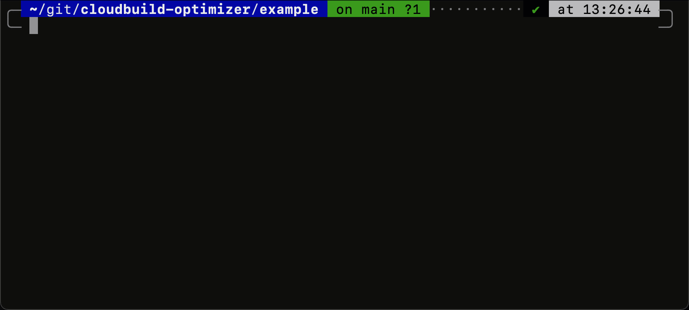

# Cloud Build Optimizer

This tool allows you to quickly run your Cloud Build configuration against multiple machine types in parallel. 

Once the jobs are complete you get a read out of the time each took and how much they cost.



## Quick Start

This repo includes and example `cloudbuild.yaml` that compiles the Linux kernel. 
Below are the steps to test out that configuration across the available Cloud Build machine types.

1. Download the latest release:

    ```shell
    curl -L https://github.com/viglesiasce/cloudbuild-optimizer/releases/download/v0.2.0/cloudbuild-optimizer_0.2.0_$(uname)_$(uname -m) -o cloudbuild-optimizer
    chmod +x cloudbuild-optimizer
    ```

1. Clone this repo and change directories to the `example` folder:

    ```shell
    git clone https://github.com/viglesiasce/cloudbuild-optimizer
    cd cloudbuild-optimizer/example
    ```

1. Run the tool.

    ```shell
    $ ./cloudbuild-optmizer
    ```

    You should see output as follows:
    
    ```shell
    View your builds here: https://console.cloud.google.com/cloud-build/builds

    Starting build on DEFAULT...
    Starting build on E2_HIGHCPU_32...
    Starting build on E2_HIGHCPU_8...
    Build completed on E2_HIGHCPU_32 in 5.64 minutes.
    Build completed on E2_HIGHCPU_8 in 8.56 minutes.
    Build completed on DEFAULT in 41.50 minutes.

    Build took 5m38.502519808s minutes on E2_HIGHCPU_32 and cost $0.361
    Build took 8m33.552805059s minutes on E2_HIGHCPU_8 and cost $0.137
    Build took 41m29.819853143s minutes on DEFAULT and cost $0.124
    ```
